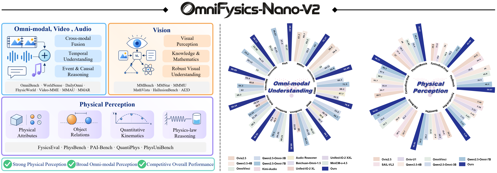
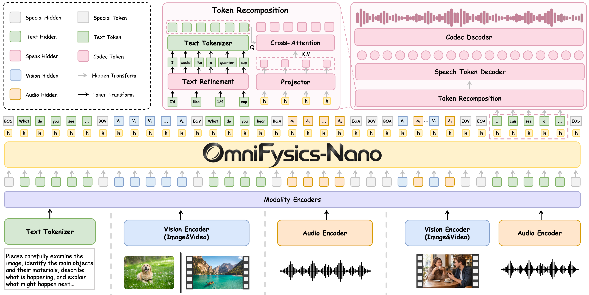
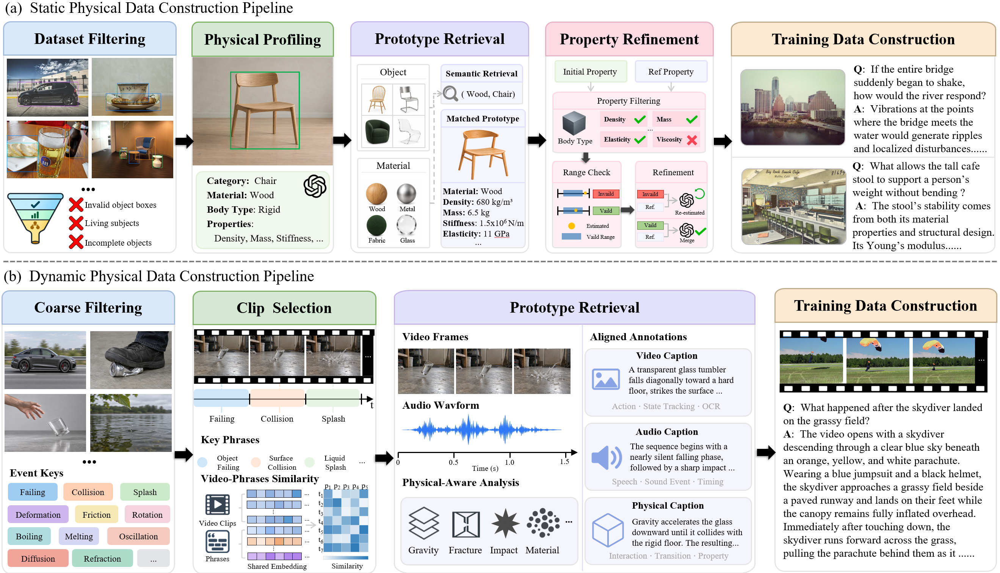
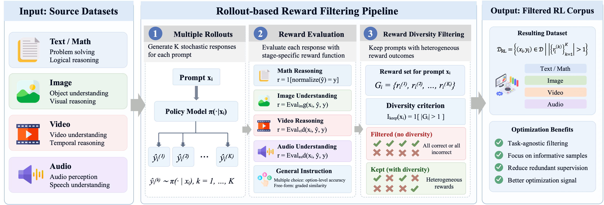
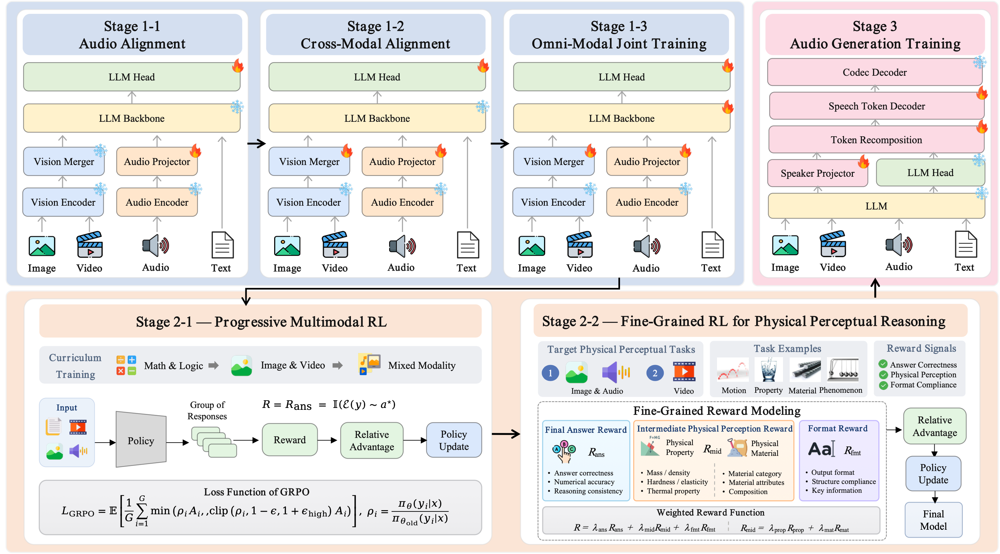
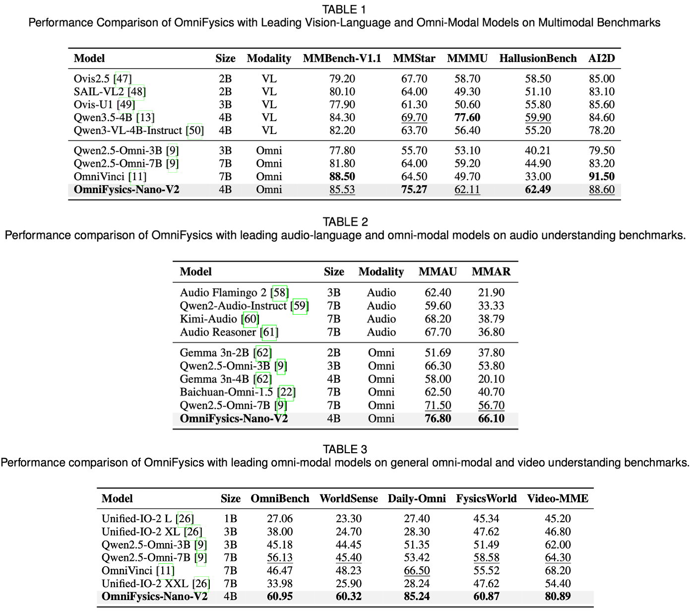
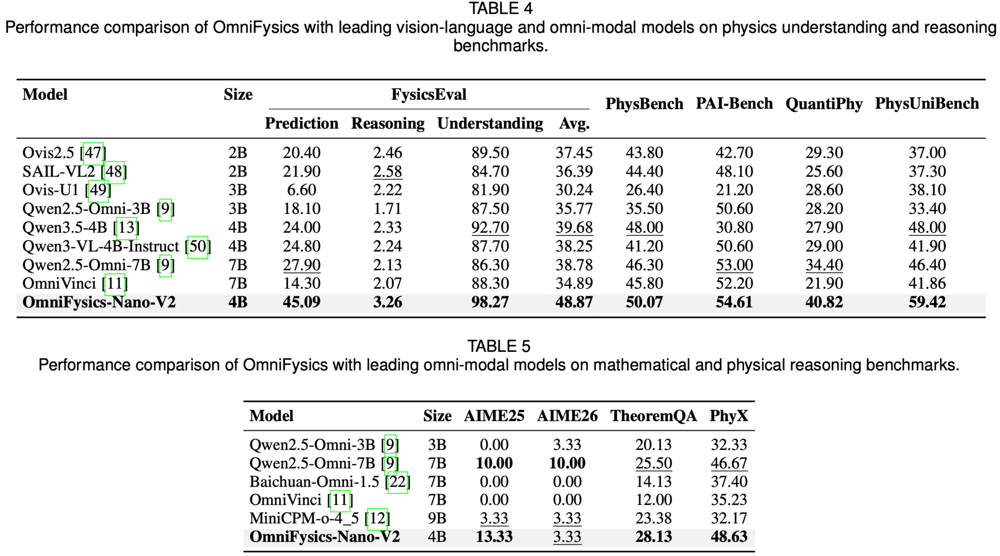

# OmniFysics-Nano-V2

<p align="center">
  
</p>

<p align="center">
  <a href="#paper">📄 Paper</a> •
  <a href="https://github.com/Fysics-AI/OmniFysics-Nano-V2.git">🌐 Project Page</a> •
  <a href="https://huggingface.co/Fysics-AI/OmniFysics-Nano-V2">🤗 Model</a> •
  <a href="#citation">📚 Citation</a>
</p>

We present **OmniFysics‑Nano‑V2**, a compact 4B omni‑modal model that supports holistic understanding of images, videos, audios, speeches, and texts with speech output capability. We design a dual‑branch physical supervision pipeline that complements static physical attribute grounding and dynamic physical event modeling. We develop a reward‑diversity filtering for policy‑aware RL data curation, and a two‑stage GRPO strategy that optimizes general task performance and enhances fine‑grained physical reasoning via intermediate perception supervision. The proposed model achieves leading result on 17 of 21 benchmarks against SOTA omni‑modal models, with ablations showing substantial improvements over SFT and large reductions in RL data and compute.

## 1.Architecture of OmniFysics-Nano-V2
We propose the OmniFysics-Nano-V2, a compact 4B omni-modal model for physical-world perception and understanding. The model supports the understanding of image, video, audio, speech, and text inputs, alongside text and audio generation capabilities.
<p align="center">
  
</p>

To address the problem of Ambiguous Physical Supervision, we construct a physics-aware data pipeline with complementary Static and Dynamic branches.
<p align="center">
  
</p>

We develop a reward-diversity filtering for policy-aware RL data curation, and a two-stage GRPO strategy that optimizes general task performance and enhances fine-grained physical reasoning via intermediate perception supervision.
<p align="center">
  
</p>
<p align="center">
  
</p>


## 2.Repository Layout

Clone the repository:

```bash
git clone https://github.com/Fysics-AI/OmniFysics-Nano-V2.git
cd OmniFysics-Nano-V2
```

Download the model weights `OmniFysics-Nano-V2` and `Fun-CosyVoice3-0.5B-2512`:

```bash
huggingface-cli download Fysics-AI/OmniFysics-Nano-V2 --local-dir hf_ckpt
huggingface-cli download FunAudioLLM/Fun-CosyVoice3-0.5B-2512 --local-dir CosyVoice3-0_5B
```

The final directory layout is:

```text
OmniFysics-Nano-V2/
├── hf_ckpt/                  # OmniFysics-Nano-V2 checkpoint
├── CosyVoice3-0_5B/          # CosyVoice3 checkpoint
├── CosyVoice/                # CosyVoice runtime source and spk2info.pt
├── assets/                   # Example image, video, and audio inputs
└── scripts/Inference_Multimodal.py
```

## 3.Environment Setup

Option 1: create the environment from the provided Conda environment yaml file.

```bash
conda env create -f environment.yml
conda activate OmniFysics-Nano-V2
```

Option 2: follow the step-by-step setup in [environment.md](environment.md).

## 4.Inference: Multimodal Input & Text Output

`scripts/Inference_Multimodal.py` is the only inference command. Text-only and multimodal inference do not generate speech by default.

```bash
python scripts/Inference_Multimodal.py --model-path hf_ckpt \
  --prompt "介绍一下你自己"
```

Supply media with `--image`, `--video`, or `--audio`:

```bash
python scripts/Inference_Multimodal.py --model-path hf_ckpt \
  --prompt "描述这张图像" \
  --image assets/test_image.png
```

## 5.Inference: Multimodal Input & Wav Output

Generate a WAV file with the preset speaker profile:

```bash
python scripts/Inference_Multimodal.py --model-path hf_ckpt \
  --prompt "今天天气怎么样" \
  --output-audio output/result.wav
```

## 6.Performance
We evaluated OmniFysics-Nano-V2 on 21 benchmarks that cover general multimodal, audio, omni-modal / video, physical understanding, mathematical reasoning and physical reasoning benchmarks.
The OmniFysics-Nano-V2 achieves SOTA performance on 17 benchmarks with 4B model size, even against 7B-scale baseline models.
Notably, the OmniFysics-Nano-V2 achieves 98.27% on FysicsEval Understanding and 59.42% on PhysUniBench, surpassing the state-of-the-art baselines by 5.57% and 11.42%, respectively.


Performance on general multimodal, audio, omni-modal, and video benchmarks.
<p align="center">
  
</p>


Performance on physical understanding, mathematical reasoning and physical reasoning benchmarks.
<p align="center">
  
</p>

## Acknowledgments

This work is built upon the following open‑source repositories:
- **[Framework‑A](https://github.com/xxx/framework‑a)**: for the foundational model backbone implementation.
- **[Framework‑B](https://github.com/xxx/framework‑b)**: for training and inference utilities.

We sincerely thank the authors and contributors for releasing their code.


## Citation

```bibtex
@article{liu2026omnifysics-nano-v2,
  title   = {XXXX},
  author  = {Yizhou Liu, Jinghang Han, Kaixiang Qiu, Qi He, Shunli Wang, Lihua Zhang, Dingkang Yang},
  journal = {arXiv preprint},
  year    = {2026}
}
```

## License

The content of this repository is released under the Apache License 2.0 with an additional **non-commercial** restriction: it may be used, reproduced, and distributed for research and educational purposes only. Any commercial use is prohibited without prior written permission from the maintainers. Source videos remain subject to the licenses of their original datasets.

